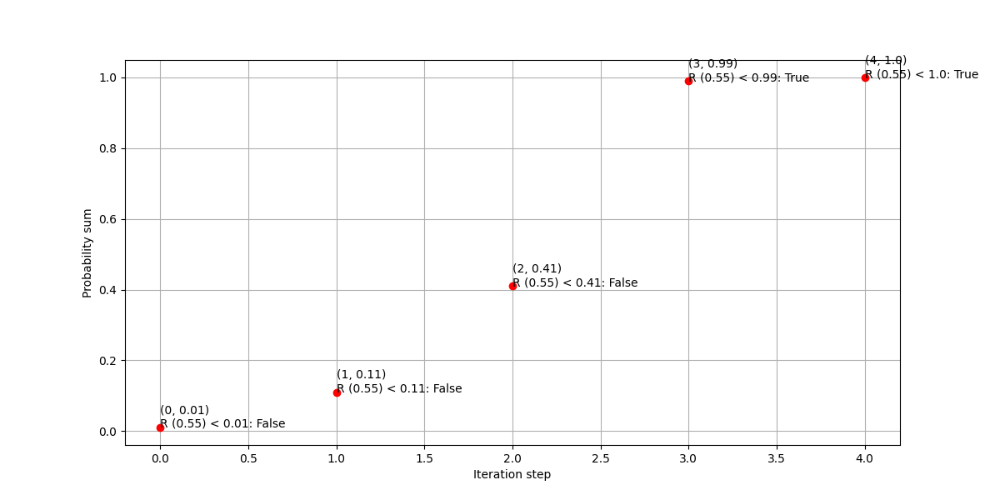

# Random generation task

## Solution

Iterate over the probabilities and compare the randomly generated number between 0 and 1 to the current sum of probabilities for the iteration step.

The diagram below illustrates the loop and the intermediate sum of the probabilities on each step. In the example shown the randomly generated number (R) is 0.55.




## Installation

```bash
python -m venv /path/to/venv
source /path/to/venv/bin/activate
pip install -r requirements.txt
```

## Usage

```python
from generator import RandomGen

random_nums = [-1, 0, 1, 2, 3]
probabilities = [0.01, 0.1, 0.3, 0.58, 0.01]
random_gen = RandomGen(random_nums, probabilities)
num = random_gen.next_num()
```

## Testing

```bash
pytest tests.py
```